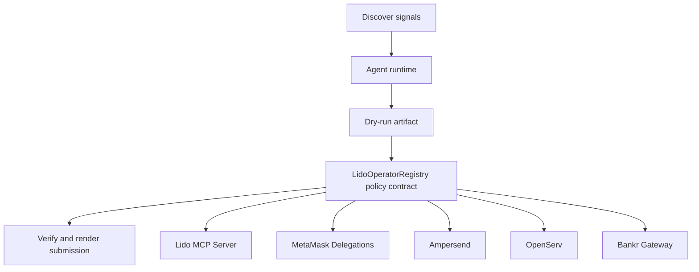

# stETH Operator MCP

- **Repo:** `Synthesis-Lido-MCPServer`
- **Primary track:** Lido MCP Server
- **Category:** mcp
- **Submission status:** implementation ready, waiting for credentials and TxIDs.

An agent-friendly MCP server for staking, wrapping, rewards, governance, and dry-run verbs with explicit policy envelopes and audit logs.

## Selected concept

A local MCP server exposes stake, wrap, rewards, governance, and dry-run verbs with explicit policy envelopes. The supporting contract tracks approved operator intents while the Python server keeps compute budgets and audit logs tied to every call.

## Idea shortlist

1. Agent-Friendly Stake Server
2. Dry-Run First Treasury Adapter
3. Governance-Aware Yield MCP

## Partners covered

Lido MCP Server, MetaMask Delegations, Ampersend, OpenServ, Bankr Gateway

## Architecture



## Repository layout

- `src/`: shared policy contracts plus the repo-specific wrapper contract.
- `script/`: Foundry deployment entrypoint.
- `agents/`: Python runtime, partner adapters, and project metadata.
- `scripts/`: CLI utilities for running the loop and rendering submissions.
- `docs/`: architecture, credentials, demo script, and security notes.
- `submissions/`: generated `synthesis.md` snippet for this repo.

## Action catalog

| Action | Partner | Purpose | Max USD | Sensitivity |
| --- | --- | --- | --- | --- |
| `lido_mcp_server_mcp_call` | Lido MCP Server | Use Lido MCP Server for a bounded action in this repo. | $2 | medium |
| `metamask_delegations_delegate_scope` | MetaMask Delegations | Use MetaMask Delegations for a bounded action in this repo. | $2 | high |
| `ampersend_settlement_bundle` | Ampersend | Use Ampersend for a bounded action in this repo. | $25 | medium |
| `openserv_job_dispatch` | OpenServ | Use OpenServ for a bounded action in this repo. | $10 | medium |
| `bankr_gateway_compute_route` | Bankr Gateway | Use Bankr Gateway for a bounded action in this repo. | $10 | high |

## Commands

```bash
python3 -m unittest discover -s tests
forge test
python3 scripts/run_agent.py
python3 scripts/plan_live_demo.py
python3 scripts/render_submission.py
```

## Credentials

| Partner | Variables | Docs |
| --- | --- | --- |
| Lido MCP Server | RPC_URL | https://docs.lido.fi/ |
| MetaMask Delegations | RPC_URL | https://docs.metamask.io/delegation-toolkit/ |
| Ampersend | AMPERSEND_API_KEY, AMPERSEND_PAYMENT_URL | https://docs.ampersend.ai/ |
| OpenServ | OPENSERV_API_KEY, OPENSERV_AGENT_URL | https://docs.openserv.ai/ |
| Bankr Gateway | BANKR_API_KEY, BANKR_CHAT_COMPLETIONS_URL, BANKR_MODEL | https://bankr.bot/ |

## Live demo plan

1. Copy .env.example to .env and fill the required keys.
2. Deploy the contract with forge script script/Deploy.s.sol --broadcast for LidoOperatorRegistry.
3. Run python3 scripts/run_agent.py to produce a dry run for lido_mcp_server.
4. Set LIVE_MODE=true and rerun python3 scripts/run_agent.py with real credentials.
5. Run python3 scripts/render_submission.py and attach TxIDs plus repo links.
